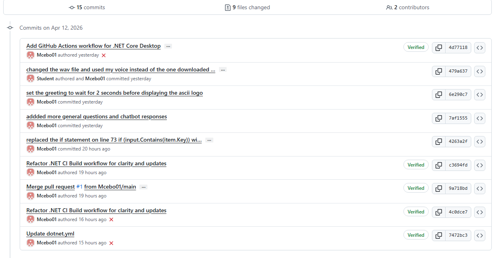

# ai_chat1

## Overview
This project is a C# console-based chatbot designed to educate users about basic cybersecurity practices.  
It provides interactive responses to help users understand topics such as password safety, phishing, and safe browsing.

---

## Features

-  Voice greeting on startup
-  ASCII art logo display
-  User name input and personalised greeting
-  Interactive chatbot conversation
-  Cybersecurity awareness responses:
  - Password safety
  - Phishing scams
  - Safe browsing
-  Input validation and error handling
-  Enhanced console UI (colours and formatting)

---

##  Technologies Used

- C# (.NET)
- Console Application
- System.Media (for audio)
- System.Drawing (for ASCII image)

---

##  How to Run the Application

1. Open the project in **Visual Studio**
2. Build the solution
3. Run the program (F5 or Start button)
4. Interact with the chatbot in the console

---

##  Example Questions You Can Ask

- How are you?
- What is your purpose?
- What can I ask you about?
- How do I create a strong password?
- What is phishing?
- Is it safe to click links?

---

##  GitHub & Continuous Integration (CI)

This project uses **GitHub Actions** for Continuous Integration.

- ✔ Automatically builds the project on each push
- ✔ Detects syntax or build errors
- ✔ Ensures code is always working

###  CI Workflow Screenshot

---

##  Project Structure
